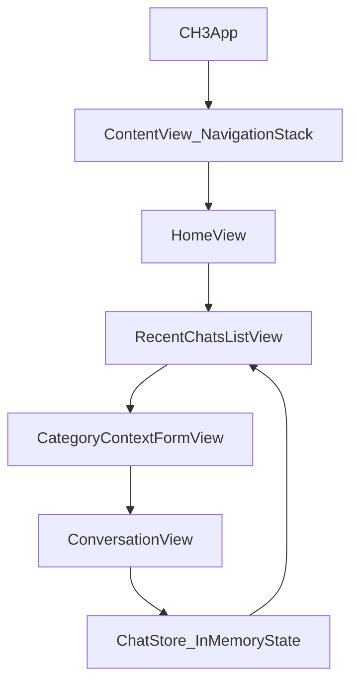
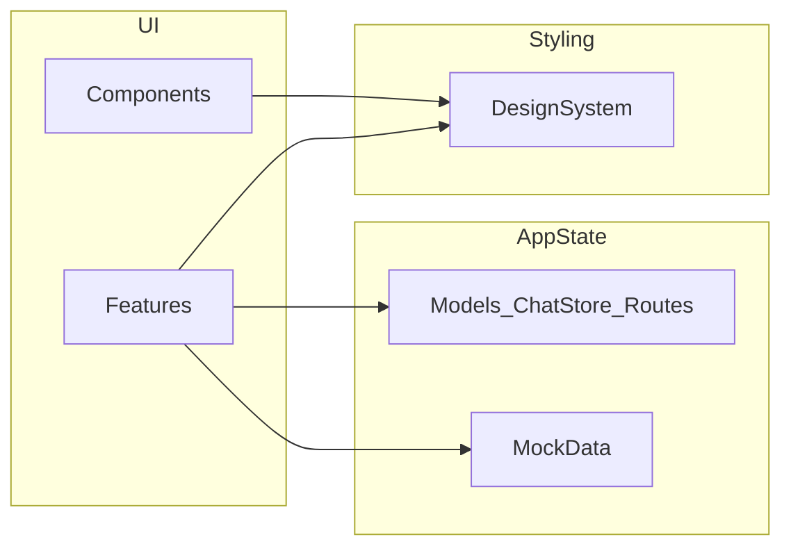

# Conversa

**Your AI communication companion for accessible travel**

Conversa is an iOS app focused on helping deaf and hard-of-hearing travelers communicate confidently in real-world situations like transport, hotels, stores, and everyday interactions.

## Quick Snapshot

- Accessibility-first travel communication app built with SwiftUI.
- Current build is a functional prototype with mock-driven conversation flows.
- Category-based chat journeys: **Transport**, **Hotel**, **Store**, **Quick Chat**.
- In-memory chat history and context forms are implemented.
- AI/translation/speech capabilities are part of the product direction and roadmap.

## Current Status

### Implemented in this repository

- Home screen with category navigation and recent chats flow.
- Context forms for gathering conversation details before starting a chat.
- Conversation screen with suggestions and message input interactions.
- Shared in-memory state via `ChatStore` and seeded mock data.
- Design system primitives for colors, typography, chips, cards, and category theming.

### Planned / vision-forward capabilities

- AI-powered contextual response generation.
- Speech-to-text for incoming spoken language.
- Real-time translation between user and local language.
- Text-to-speech playback for outgoing responses.
- Smarter long-term personalization and memory.

## Why Conversa

Travel communication often breaks down exactly when clarity is most important. Conversa is designed to reduce that friction and help users navigate unfamiliar places with greater independence, confidence, and speed.

## Tech Stack & Requirements

- SwiftUI-based iOS application (`CH3` target).
- Swift language version set to `5.0`.
- iOS deployment target currently configured as `26.0` (project also includes `26.5` settings in some build configs).
- Xcode project created/upgraded with Xcode 26.5-era metadata.
- Automatic signing is enabled; local development may require updating team/bundle settings.

## Quick Start

### Run with Xcode (recommended)

1. Open `CH3/CH3.xcodeproj` in Xcode.
2. Select scheme: `CH3`.
3. Choose an iOS Simulator.
4. Press **Run**.

## Project Structure (Developer + AI Agent Map)

- `CH3/CH3/CH3App.swift`: app entry point.
- `CH3/CH3/ContentView.swift`: root navigation and environment wiring.
- `CH3/CH3/Features/`: feature screens (`Home`, `RecentChats`, `ContextForm`, `Conversation`).
- `CH3/CH3/Models/`: routes, message/domain models, and app state (`ChatStore`).
- `CH3/CH3/MockData/`: prototype data and form definitions.
- `CH3/CH3/DesignSystem/`: colors, typography, styles, category theming.
- `CH3/CH3/Components/`: reusable UI building blocks.

### Where to edit what

- New screen/flow behavior: `CH3/CH3/Features/`.
- State/navigation/data models: `CH3/CH3/Models/`.
- Prototype question sets and seed content: `CH3/CH3/MockData/`.
- UI consistency and visual tokens: `CH3/CH3/DesignSystem/`.
- Reusable controls and rows: `CH3/CH3/Components/`.

## App Flow

## Architecture at a Glance

## Testing & Limitations

- No XCTest target is currently configured in this repository.
- Current experience is prototype-driven using mock data.
- Live AI/translation/speech services are not wired in yet.
- Code signing/team settings may need local adjustment per developer machine.

## Roadmap

- Integrate AI response backend for live context-aware chats.
- Add speech-to-text and text-to-speech pipeline.
- Add translation service with language preferences.
- Introduce persistence for conversations and user settings.
- Add automated tests (unit + UI) and CI checks.

## Contribution Starter

- Create a feature branch from your main branch.
- Keep changes focused and small where possible.
- Run the app locally before opening a PR.
- In PRs, include what changed, why, and how it was tested.

## Vision

Conversa aims to remove communication barriers and make travel more accessible for deaf and hard-of-hearing individuals by combining accessibility-centered UX with intelligent language assistance.
