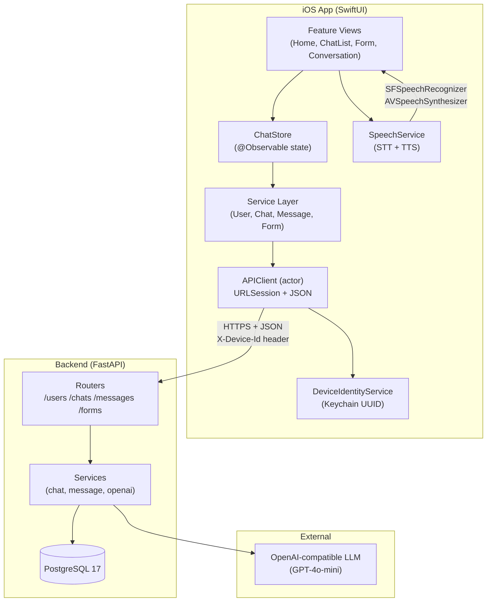

# Conversa

**Your AI communication companion for accessible travel**


Conversa is an iOS app that helps deaf and hard-of-hearing travelers communicate confidently in real-world situations — transport, hotels, stores, and everyday interactions. It transcribes spoken language in real time, translates and speaks your replies aloud, and uses AI to suggest context-aware responses.

---

## What Conversa Does

| Feature | How it works |
|---|---|
| 🎤 **Live transcription** | The hearing person speaks → their words appear on your screen in real time using on-device speech recognition |
| 🔊 **Text-to-speech** | You type a response → the app speaks it aloud in the local language with a native accent |
| 🤖 **AI-powered replies** | An LLM generates context-aware suggestions and replies based on your situation (hotel check-in, taxi ride, shopping, etc.) |
| 📋 **Context forms** | Before a conversation, tell the AI who you are, where you're staying, what you need — so every reply is relevant |
| 🌍 **Country-aware** | Language, accent, and suggestions adapt automatically to the country you're in (35+ countries mapped) |

---

## Typical User Flow

```
┌─────────────────────────────────────────────────────────────────────┐
│                     A Day with Conversa                              │
└─────────────────────────────────────────────────────────────────────┘

1. OPEN THE APP
   ┌──────────────────────────────────────┐
   │  Hello, Anna!                        │
   │  What are your plans today?          │
   │                                      │
   │  ┌─────────┐  ┌─────────┐           │
   │  │ ✈️      │  │ 🛒      │           │
   │  │Transport│  │  Store  │           │
   │  └─────────┘  └─────────┘           │
   │  ┌─────────┐  ┌─────────┐           │
   │  │ 🛏️      │  │ 💬      │           │
   │  │  Hotel  │  │  Misc   │           │
   │  └─────────┘  └─────────┘           │
   └──────────────────────────────────────┘
   Device automatically registers with the backend.

2. TELL THE AI ABOUT YOUR SITUATION (Context Form)
   ┌──────────────────────────────────────┐
   │  🛏️                                 │
   │                                      │
   │  What hotel are you staying at?      │
   │  ┌──────────────────────────────┐   │
   │  │ Famous Hotel                 │   │
   │  └──────────────────────────────┘   │
   │                                      │
   │              [Continue]              │
   └──────────────────────────────────────┘
   Answer 5-7 questions about your stay. The AI learns:
   • Hotel name & booking details
   • Your preferences (quiet room, no allergies)
   • What you need help communicating

   ┌──────────────────────────────────────┐
   │            🥳                        │
   │  The AI has learned about you.       │
   │  Your experience will be smoother    │
   │  now!                                │
   │                                      │
   │           [Continue]                 │
   └──────────────────────────────────────┘

3. START THE CONVERSATION
   ┌──────────────────────────────────────┐
   │  Famous Hotel                        │
   │                                      │
   │  You can now start the conversation  │
   │                                      │
   └──────────────────────────────────────┘
   ┌──────────────────────────────────────┐
   │  ✨ Suggestions                      │
   │  ┌──────────────────────────────┐   │
   │  │ Can I have a late checkout?  │   │
   │  └──────────────────────────────┘   │
   │  ┌──────────────────────────────┐   │
   │  │ Is breakfast included?       │   │
   │  └──────────────────────────────┘   │
   │  ┌──────────────────────────────┐   │
   │  │ Where is the nearest pharmacy│   │
   │  └──────────────────────────────┘   │
   │                                      │
   │  ┌──────────────────────────────┐   │
   │  │ Type a message...            │   │
   │  └──────────────────────────────┘   │
   │                                      │
   │              🎤                      │
   └──────────────────────────────────────┘
   AI suggests phrases based on your hotel context.

4. THE HEARING PERSON SPEAKS (Live Transcription)
   ┌──────────────────────────────────────┐
   │  Famous Hotel                        │
   │                                      │
   │  ┌──────────────────────────────────┐│
   │  │ 🔴 LISTENING                    ││
   │  │ "Welcome to Famous Hotel. How   ││
   │  │  can I help you today?"         ││
   │  └──────────────────────────────────┘│
   │                                      │
   │              ⏹                       │
   └──────────────────────────────────────┘
   Tap the mic → it captures what the receptionist says.
   Live text updates in real time as they speak.
   Tap stop → the transcript becomes a message, auto-sent to AI.

5. AI SUGGESTS A REPLY
   ┌──────────────────────────────────────┐
   │  Famous Hotel                        │
   │                                      │
   │  ┌──────────────────────────────┐   │
   │  │ "Welcome to Famous Hotel.    │   │
   │  │  How can I help you today?"  │◀── transcribed speech
   │  └──────────────────────────────┘   │
   │                                      │
   │                         ┌──────────┐│
   │                         │ I have a ││
   │                         │ reservat-││
   │                         │ ion under││
   │                         │ Anna     ││
   │                         │ Smith.   ││
   │                         │     🔊   ││── tap to speak aloud
   │                         └──────────┘│
   └──────────────────────────────────────┘

6. TAP 🔊 TO SPEAK YOUR REPLY ALOUD
   The receptionist hears: "I have a reservation under Anna Smith."
   Spoken in their local language with a natural accent.

7. THE CONVERSATION CONTINUES
   • Each time they speak → 🎤 transcribes it
   • Each time AI replies → 🔊 you can speak it aloud
   • Suggestions update as context changes
   • Your chat is saved — pick it up later from Recent Chats
```

---

## Current Status

### ✅ Implemented

| Layer | What's built |
|---|---|
| **iOS UI** | Home, category cards, recent chats list with search, multi-step context forms (text, yes/no, date inputs), conversation view with bubble chat, suggestions chips, glass-morphism design system |
| **Backend** | FastAPI with async PostgreSQL, device-based auth via `X-Device-Id`, CRUD for chats/messages, AI reply generation via OpenAI-compatible LLM, form definitions, phrase suggestions |
| **Integration** | Full API parity — all views load from backend, messages send/receive in real time, chat creation with context answers, pull-to-refresh, error states with retry across all views |
| **Speech** | On-device STT (SFSpeechRecognizer) with live transcription banner, 35+ country→locale mappings, on-device TTS (AVSpeechSynthesizer) with native voices, auto-send transcript to AI |
| **Identity** | Keychain-backed UUID, auto-registration on first launch, idempotent backend registration |

### 🚧 Coming next

- Speech-to-text language auto-detection
- Accessibility audit (VoiceOver, Dynamic Type)
- Offline message queue (send when back online)
- XCTest unit + UI test suite
- CI pipeline

---

## Tech Stack

| Component | Technology |
|---|---|
| iOS UI | SwiftUI, iOS 26+ |
| State management | `@Observable` (Swift Observation) |
| Networking | Swift Concurrency (`async/await` + `URLSession`) |
| Speech-to-text | `Speech` framework (`SFSpeechRecognizer`) |
| Text-to-speech | `AVFAudio` (`AVSpeechSynthesizer`) |
| Device identity | Keychain Services |
| Backend framework | FastAPI (Python 3.12+) |
| Database | PostgreSQL 17 + SQLAlchemy async + Alembic |
| AI / LLM | OpenAI-compatible API (GPT-4o-mini, or any provider via `LLM_BASE_URL`) |
| Infrastructure | Docker Compose (API + DB) |

---

## Quick Start

### 1. Start the backend

```bash
cd backend

# Set LLM credentials
export LLM_API_KEY=sk-your-key-here
export LLM_MODEL=gpt-4o-mini

# Start API + PostgreSQL
docker compose up -d

# Apply migrations
docker compose exec api alembic upgrade head

# Verify
curl http://localhost:8000/health
# → {"status": "ok"}
```

### 2. Add privacy keys in Xcode

The app needs microphone and speech recognition permissions. In Xcode:

1. Open `CH3/CH3.xcodeproj`
2. Select the **CH3** target → **Info** tab
3. Add these two entries:

| Key | Value |
|---|---|
| `Privacy - Speech Recognition Usage Description` | `Conversa uses speech recognition to transcribe what people say to you in real time.` |
| `Privacy - Microphone Usage Description` | `Conversa needs the microphone to capture speech for live transcription.` |

### 3. Add new source files to the project

In Xcode, right-click the `CH3` group → **Add Files to "CH3"…** and add these folders:

- `CH3/CH3/Networking/`
- `CH3/CH3/Services/`
- `CH3/CH3/Models/API/`
- `CH3/CH3/Helpers/`

Ensure **"Create groups"** is selected and the **CH3** target is checked.

### 4. Run

1. Select scheme: **CH3**
2. Choose an iOS Simulator (iPhone 16+)
3. Press **Run** (⌘R)

### What happens on first launch

1. App generates a UUID → stores in Keychain
2. Registers device with backend: `POST /api/users/register`
3. Home screen shows category cards
4. Tap a category → chat list loads from backend (empty at first)
5. Tap compose → fill context form → AI learns about your situation
6. Start conversing: type messages, use 🎤 for live transcription, 🔊 to speak replies

---

## Project Structure

```
ch3-applepie/
├── backend/                          # FastAPI backend
│   ├── app/
│   │   ├── main.py                   # App setup, CORS, router mounting
│   │   ├── config.py                 # Settings from env vars
│   │   ├── database.py               # Async SQLAlchemy engine
│   │   ├── dependencies.py           # Auth guards (X-Device-Id)
│   │   ├── models/                   # SQLAlchemy ORM entities
│   │   ├── schemas/                  # Pydantic request/response schemas
│   │   ├── routers/                  # /users, /chats, /messages, /forms
│   │   └── services/                 # Business logic + OpenAI client
│   ├── alembic/                      # DB migrations
│   ├── Dockerfile
│   ├── docker-compose.yml
│   └── requirements.txt
│
├── CH3/                              # iOS app
│   └── CH3/
│       ├── CH3App.swift              # Entry point + device registration
│       ├── ContentView.swift         # Root navigation
│       ├── Networking/               # HTTP layer
│       │   ├── APIClient.swift       # actor URLSession wrapper
│       │   ├── APIEnvironment.swift  # Base URL config
│       │   └── APIError.swift        # Typed error enum
│       ├── Services/                 # API + platform services
│       │   ├── DeviceIdentityService.swift  # Keychain UUID
│       │   ├── UserService.swift            # /api/users/*
│       │   ├── ChatService.swift            # /api/chats/*
│       │   ├── MessageService.swift         # /api/messages/*
│       │   ├── FormService.swift            # /api/forms/* + suggestions
│       │   └── SpeechService.swift          # SFSpeechRecognizer + AVSpeechSynthesizer
│       ├── Helpers/
│       │   └── LocaleMapper.swift     # Country code → speech locale
│       ├── Models/
│       │   ├── API/                  # DTOs mirroring backend schemas
│       │   ├── AppModels.swift       # Domain models
│       │   ├── ContextFormModels.swift
│       │   ├── ChatStore.swift       # @Observable state
│       │   ├── ChatMessageLayout.swift
│       │   └── AppRoute.swift        # Navigation routes
│       ├── Features/
│       │   ├── Home/                 # Home screen
│       │   ├── RecentChats/          # Chat list + search
│       │   ├── ContextForm/          # Category form + transport picker
│       │   ├── Conversation/         # Chat view with STT/TTS
│       │   └── Shared/               # AI learned modal
│       ├── Components/               # Reusable UI (bubbles, chips, cards, input bar)
│       ├── DesignSystem/             # Colors, typography, category themes
│       └── MockData/                 # Legacy mock data (fallback)
│
├── INTEGRATION.md                    # Full integration docs (API ref, data flow, troubleshooting)
└── README.md                         # This file
```

---

## Architecture



### Data flow summary

| Action | Flow |
|---|---|
| **App launch** | Keychain UUID → `POST /api/users/register` → ready |
| **Load chats** | `GET /api/chats` → `ChatListItem[]` → `RecentChat[]` → UI |
| **Fill form** | `GET /api/forms/{type}` → steps → user answers → `POST /api/chats` with context |
| **Send message** | `POST /api/chats/{id}/messages` → user message saved → AI reply returned |
| **Live transcribe** | 🎤 tap → `SFSpeechRecognizer` → live text banner → stop → append message → auto-send to AI |
| **Speak reply** | 🔊 tap → `AVSpeechSynthesizer.speak()` with country voice |
| **Get suggestions** | `POST /api/chats/{id}/suggestions` → AI generates context-aware phrases |

---

## API Surface

All endpoints prefixed with `/api`. Full reference in [INTEGRATION.md](./INTEGRATION.md).

| Method | Endpoint | Purpose |
|---|---|---|
| `POST` | `/api/users/register` | Register device (idempotent) |
| `GET` | `/api/chats` | List user's chats |
| `POST` | `/api/chats` | Create chat with context |
| `GET` | `/api/chats/{id}` | Get single chat |
| `DELETE` | `/api/chats/{id}` | Soft-delete chat |
| `GET` | `/api/chats/{id}/messages` | Paginated message history |
| `POST` | `/api/chats/{id}/messages` | Send message + get AI reply |
| `GET` | `/api/forms/{type}` | Get form definition |
| `POST` | `/api/chats/{id}/suggestions` | Generate quick-reply phrases |

---

## Testing & Limitations

- No XCTest target configured yet
- Backend requires a running PostgreSQL instance and LLM API key
- Mock data still initializes `ChatStore` as fallback; real data replaces it on first successful load
- Physical device needs the Mac's IP in `APIEnvironment.swift` (simulator uses `localhost` automatically)

---

## Roadmap

- [x] AI response backend for context-aware chats
- [x] On-device speech-to-text with live transcription
- [x] On-device text-to-speech with country-aware voices
- [x] Full API integration (all endpoints wired to iOS)
- [x] Device identity via Keychain
- [x] Pull-to-refresh and error recovery across all views
- [ ] Speech-to-text language auto-detection
- [ ] Message persistence / offline queue
- [ ] Accessibility audit (VoiceOver, Dynamic Type, high contrast)
- [ ] XCTest unit + UI test suite
- [ ] CI pipeline (build + test on PR)

---

## Contribution

- Create a feature branch from `main`
- Keep changes focused and small
- Run the app locally before opening a PR
- In PRs, include what changed, why, and how it was tested

---

## Vision

Conversa removes communication barriers and makes travel accessible for deaf and hard-of-hearing individuals by combining accessibility-centered UX, real-time speech transcription, AI-powered conversation assistance, and text-to-speech — all in one app that works the moment you land in a new country.
