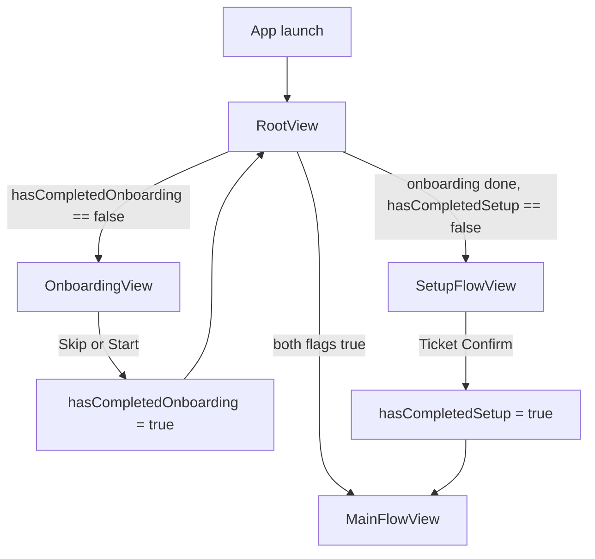
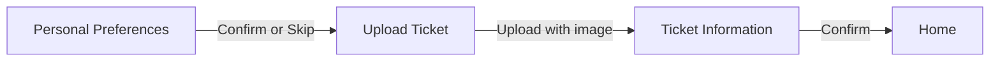
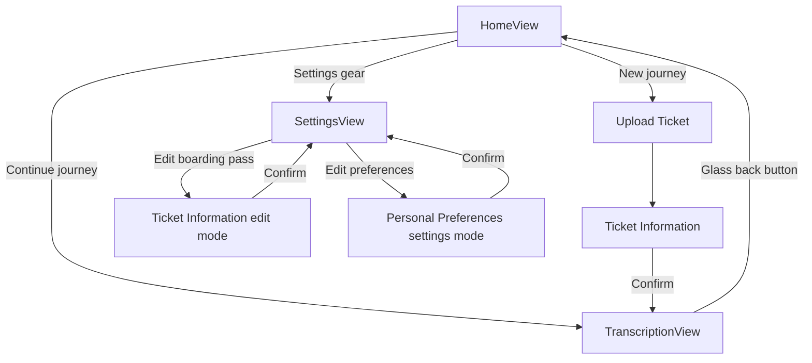
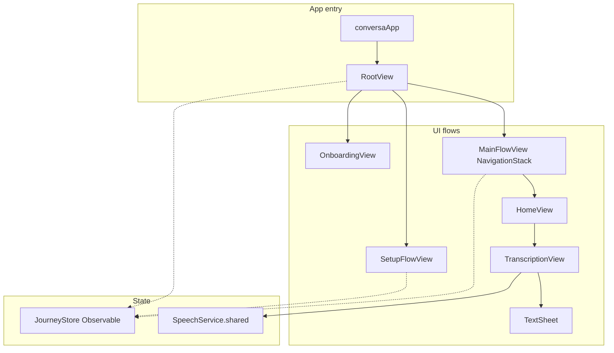

# Conversa — iOS App (SwiftUI)

Native Swift frontend for **Conversa**, an AI-assisted communication app for deaf and hard-of-hearing travelers at airports. This document describes the **current iOS implementation**: architecture, user flows, screens, persistence, and how to build and run the app.

For the full product vision, backend API, and monorepo overview, see the [repository root README](../README.md).

---

## Table of contents

1. [Overview](#overview)
2. [Requirements](#requirements)
3. [Getting started](#getting-started)
4. [User app flow](#user-app-flow)
5. [Screen reference](#screen-reference)
6. [Transcription and text sheet](#transcription-and-text-sheet)
7. [Architecture](#architecture)
8. [State and persistence](#state-and-persistence)
9. [Navigation](#navigation)
10. [Design system](#design-system)
11. [Services](#services)
12. [Project structure](#project-structure)
13. [Privacy and permissions](#privacy-and-permissions)
14. [Previews and testing](#previews-and-testing)
15. [Resetting app state](#resetting-app-state)
16. [Backend integration status](#backend-integration-status)
17. [Roadmap (iOS)](#roadmap-ios)

---

## Overview

Conversa on iOS helps users:

- **Transcribe** what airport staff say in real time (on-device speech recognition).
- **Compose replies** in a persistent bottom sheet with suggestions and a large editor.
- **Show replies** via **Flip Text** (full-screen, rotated text for the other person to read).
- **Store journey context** (preferences, boarding pass / ticket details) for a smoother airport experience.

The app is organized as a **linear first-run experience** (onboarding → setup), then a **Home hub** for continuing or starting journeys, with **Settings** for editing ticket and preferences.

| Area | Status |
|------|--------|
| Onboarding (2 pages) | Implemented |
| First-run setup (preferences, upload, ticket confirm) | Implemented |
| Home hub | Implemented |
| Settings | Implemented |
| Live transcription + mic UI | Implemented |
| Text sheet (3 detents) + Flip Text | Implemented |
| Ticket upload (photo library + camera) | Implemented |
| Ticket OCR | **Mock** — sample data after upload |
| Backend API / chat / AI suggestions | **Not wired** in this target |
| Text-to-speech in UI | **Service exists**, not exposed in UI yet |

---

## Requirements

| Requirement | Version / notes |
|-------------|-----------------|
| Xcode | 16+ (recommended for iOS 26 SDK) |
| iOS deployment target | **26.0** (Debug/Release in `conversa.xcodeproj`) |
| Swift | 6 (strict concurrency enabled in project) |
| Physical device | **Recommended** for speech recognition (Simulator support is limited/unreliable) |
| Scheme | **conversa** |
| Bundle ID | `com.javohirmx.conversa` |

---

## Getting started

### 1. Open the project

```bash
cd conversa
open conversa.xcodeproj
```

### 2. Select run destination

- **Simulator**: UI and navigation only; mic/STT may not work as on device.
- **Physical iPhone**: Required for realistic speech recognition testing.

### 3. Build and run

1. Scheme: **conversa**
2. Destination: iPhone simulator or device
3. **Run** (⌘R)

Privacy usage strings are generated via build settings in `conversa.xcodeproj` (no separate `Info.plist` file).

### 4. First launch (what you should see)

1. **Onboarding** — two pages; **Skip** or **Next** / **Start**
2. **Setup** — preferences → upload ticket → confirm ticket information
3. **Home** — journey summary and **Continue journey** / **New journey**
4. **Continue journey** → **Transcription** with text sheet

---

## User app flow

### High-level gate (`RootView`)

The app root chooses one of three experiences:



`JourneyStore` is created in `RootView` and injected with `.environment(journeyStore)` for all flows.

### First-run setup (once)



| Step | Screen | User actions | Result |
|------|--------|--------------|--------|
| 1 | Personal Preferences | Fill meal, seat, emergency contact, disability; **Skip** or **Confirm** | Preferences saved to `JourneyStore` (Skip leaves fields empty/default) |
| 2 | Upload Ticket | Pick photo or **Open Camera**; tap **Upload** (enabled when image selected) | Image stored as JPEG data; **mock** ticket fields applied |
| 3 | Ticket Information | Review/edit fields; **Confirm** | `activeTicket` saved, `hasActiveJourney = true`, setup completes → Home |

**Note:** Upload does not run real OCR. After upload, `TicketInfo.mockSample` is used as a starting point (e.g. Jakarta CGK → Bali DPS).

### Main app (after setup)



| Path | Behavior |
|------|----------|
| **Continue journey** | Opens transcription; restores `savedTranscript` and `savedDraftText` from `JourneyStore` |
| **New journey** | Upload → ticket confirm → replaces ticket, **clears** transcript and draft → opens transcription |
| **Settings → Edit boarding pass** | Ticket form in `.edit` mode; updates `activeTicket` |
| **Settings → Preferences rows** | Full preferences form (no Skip) |

### Transcription exit behavior

Leaving transcription:

1. Stops listening if the mic is active
2. Persists transcript and text sheet draft to `JourneyStore`
3. Dismisses the **Text** sheet first (~320ms)
4. Pops navigation back to **Home**

This avoids the sheet animating away late over Home.

---

## Screen reference

### Onboarding (`Features/Onboarding/`)

| Element | Detail |
|---------|--------|
| Pages | 2 (`OnboardingPage.pages`) |
| Page 1 | “Less stress” + `OnboardingLessStress` asset |
| Page 2 | “Make your journey personalized.” + `OnboardingPersonalized` asset |
| Skip | Top-right; completes onboarding immediately |
| Primary button | **Next** → page 2; **Start** → completes onboarding |
| Persistence | `@AppStorage("hasCompletedOnboarding")` |

### Personal preferences (`Features/Setup/Views/PersonalPreferencesView.swift`)

| Field | Input type |
|-------|------------|
| Meal / dietary restriction | Menu (Vegan, Vegetarian, Halal, Kosher, No restriction) |
| Seat preferences | Menu (Window, Aisle, Middle, No preference) |
| Emergency contact | Country code menu (+62, +65, …) + phone field |
| Type of disabilities | Menu (None, Deaf/HoH, Mobility, Visual, Cognitive, Other) |

| Mode | Skip | Navigation title |
|------|------|------------------|
| `firstRun` | Yes | Hidden back (setup stack) |
| `settings` | No | “Preferences” |

UI uses **ticket-stub card** styling (`TicketStubCard` + scalloped `TicketStubShape`).

### Upload ticket (`Features/Setup/Views/UploadTicketView.swift`)

- Dashed upload zone (photo library via `PhotosPicker`)
- **Open Camera** via `CameraImagePicker` (`UIImagePickerController`)
- **Upload** button disabled until an image is selected
- On upload: stores `uploadedTicketImageData`, invokes callback (setup or new journey)

### Ticket information (`Features/Setup/Views/TicketInformationView.swift`)

| Field | Notes |
|-------|--------|
| Name | Text |
| From / To | Side by side |
| Date | `DatePicker` |
| Flight ID / Time | Side by side |
| Seat / Gate / Boarding time | Three columns |

| `TicketEditorMode` | On confirm |
|--------------------|------------|
| `setupCompletion` | Saves ticket, calls setup `onComplete` |
| `newJourney` | Saves ticket, clears session, navigates to transcription |
| `edit` | Updates ticket, pops back to Settings |

### Home (`Features/Home/HomeView.swift`)

- Title **Home** + settings gear
- **Stamp placeholder** (`StampPlaceholderView` — scalloped grey area)
- **from** / **to** city labels from `activeTicket` (parses `"City (CODE)"` → `"City"`)
- **Continue journey** — orange capsule; disabled when `!hasActiveJourney`
- **New journey** — light grey capsule

Navigation bar is hidden on Home (`navigationBarHidden(true)`).

### Settings (`Features/Settings/SettingsView.swift`)

- **My boarding pass** card with **Edit >**
- Caption under card
- **Preferences** section: Meal, Seating, Emergency Contact, Type of Disability
- Meal/Seating show **Edit** + chevron; rows navigate to preferences form

### Transcription (`Features/Transcription/TranscriptionView.swift`)

| Region | Content |
|--------|---------|
| Top | Liquid Glass **back** button (`TranscriptionBackButton` — `.buttonStyle(.glass)`, circle) |
| Middle | Live transcript, saved transcript, placeholder copy, or “Start Listening” |
| Bottom | `MicControlButton` (orange rings while listening) |
| Sheet | `TextSheet` — always presented; three detents |

System navigation back is **hidden** to prevent duplicate back buttons.

---

## Transcription and text sheet

### Upper area states

| Condition | Display |
|-----------|---------|
| Mic listening | `LiveTranscriptArea` — “Listening…” placeholder until text arrives, then navy transcript |
| Mic stopped, has saved transcript | `TranscriptDisplayView` (28pt semibold, scrollable) |
| Sheet at peek (0.1), no transcript | Scrollable **placeholder** intro message for staff |
| Otherwise | “Start Listening” title |

### Mic button (`MicControlButton`)

- Tap to start/stop `SpeechService`
- On start: requests speech authorization if needed; collapses sheet from 0.5 → 0.1 when starting from medium detent
- While listening: three pulsing orange stroke rings
- Fixed 144×144 frame to avoid layout jump

### Text sheet (`Features/Transcription/TextSheet.swift`)

Non-dismissible sheet (`interactiveDismissDisabled`) with three detents:

| Detent | Fraction | UI |
|--------|----------|-----|
| Peek | 0.1 | Title “Text” only |
| Medium | 0.5 | Compact field, 2 suggestions, “See more” |
| Large | Full | `FittingTextEditor`, Clear / Flip, all suggestions |

**Suggestions** are currently **static strings** in code (not from backend AI).

**Flip Text** — `FlipTextView` full-screen cover: white background, `FittingText` auto-sized 28–120pt, rotated 180°, tap or X to close.

### Placeholder copy (staff-facing)

When the sheet is collapsed and there is no transcript:

> I am deaf, I use this device to communicate with you. Say what you want to say to me now.

---

## Architecture



### Patterns

| Pattern | Usage |
|---------|--------|
| SwiftUI | All UI |
| `@Observable` + `@MainActor` | `JourneyStore`, `SpeechService` |
| `@Environment(JourneyStore.self)` | Shared journey/preferences/ticket/session |
| `@AppStorage` | Onboarding and setup completion flags |
| `NavigationStack` + `navigationDestination(for:)` | Setup and main flows |
| Typed routes | `AppRoute`, `SetupRoute`, `TicketEditorMode`, `PreferencesEditorMode` |
| Singleton | `SpeechService.shared` for one audio session |

### Entry point

```swift
@main
struct conversaApp: App {
    var body: some Scene {
        WindowGroup {
            RootView()
        }
    }
}
```

`conversaApp` → `RootView` (onboarding/setup gate + `JourneyStore`) → `MainFlowView` (Home-root navigation).

---

## State and persistence

### `JourneyStore` (`Services/JourneyStore.swift`)

Single source of truth for user journey data. Persists to **UserDefaults** on change.

| Property | UserDefaults key | Type |
|----------|------------------|------|
| `userPreferences` | `savedUserPreferences` | JSON `UserPreferences` |
| `activeTicket` | `savedTicketInfo` | JSON `TicketInfo` |
| `uploadedTicketImageData` | `uploadedTicketImageData` | `Data` |
| `savedTranscript` | `savedTranscript` | `String` |
| `savedDraftText` | `savedDraftText` | `String` |
| `hasActiveJourney` | `hasActiveJourney` | `Bool` |

| Method | Purpose |
|--------|---------|
| `activateJourney(with:)` | Set ticket + `hasActiveJourney = true` |
| `beginNewJourneySession()` | Clear transcript and draft |
| `persistCurrentSession(transcript:draftText:)` | Save communication session |

### App-level flags (`App/RootView`)

| Key | Meaning |
|-----|---------|
| `hasCompletedOnboarding` | User finished or skipped onboarding |
| `hasCompletedSetup` | User finished first-run setup (preferences flow shown once) |

### Models

**`UserPreferences`** — meal, seat, emergency country code + phone, disability type.

**`TicketInfo`** — passenger name, airports, date, flight ID, times, seat, gate, boarding time; helpers `fromCityLabel` / `toCityLabel`.

---

## Navigation

### `AppRoute` (main stack)

```swift
enum AppRoute: Hashable {
    case settings
    case uploadTicket(isNewJourney: Bool)
    case ticketInformation(mode: TicketEditorMode)
    case personalPreferences(mode: PreferencesEditorMode)
    case transcription
}
```

### `SetupRoute` (setup stack only)

```swift
enum SetupRoute: Hashable {
    case uploadTicket
    case ticketInformation
}
```

`SetupFlowView` is **outside** `MainFlowView` until `hasCompletedSetup` is true.

---

## Design system

### Brand colors (`DesignSystem/BrandColors.swift`)

| Token | Role |
|-------|------|
| `navy` | Primary text, icons |
| `orange` | Primary CTAs, mic accent |
| `listeningGradientTop/Bottom` | Transcription background |
| `fieldBackground` | Form fields |
| `uploadZoneBackground/Border` | Upload drop zone |
| `homeSecondaryButton` | “New journey” button |
| `stampPlaceholder` | Home hero placeholder |

Asset catalog also defines `BrandNavy` and `BrandOrange` color sets.

### Typography (`DesignSystem/Typography.swift`)

Semantic font tokens: `homeTitle`, `setupTitle`, `sheetTitle`, `transcriptBody`, `formLabel`, `journeyCity`, etc. (system fonts, rounded design where noted).

### Reusable components

| Component | Location |
|-----------|----------|
| `TicketStubShape` / `TicketStubCard` | Scalloped “boarding pass” cards |
| `SetupHeaderView`, `SetupFormField`, `SetupPrimaryButton` | Setup forms |
| `StampPlaceholderView` | Home image placeholder |
| `SuggestionBubbleView` | Text sheet chips |
| `FittingTextEditor` / `FittingText` / `FittingFontSizeCalculator` | Dynamic text sizing |
| `TranscriptionBackButton` | Glass circular back control (iOS 26) |

---

## Services

### `SpeechService` (`Services/SpeechService.swift`)

`@Observable` singleton for STT and TTS.

**Speech-to-text**

- `SFSpeechRecognizer` with partial results
- On-device recognition when supported
- Committed + partial transcript merging (reduces word loss on pause)
- `isUserStopping` + filtered errors (cancel, no speech, etc.)
- Language hint via `NLLanguageRecognizer` after enough text

**Text-to-speech**

- `AVSpeechSynthesizer` — `speak(_:locale:)`, `stopSpeaking()`
- **Not yet** connected to a “Speak” button in the UI

**Authorization**

- `requestAuthorization()` async
- Alerts in `TranscriptionView` if mic/speech denied

---

## Project structure

```
conversa/
├── conversa.xcodeproj/
├── README.md                          ← this file
└── conversa/
    ├── App/
    │   ├── conversaApp.swift          @main entry
    │   └── RootView.swift             Onboarding / setup / main gate
    │
    ├── Navigation/
    │   ├── AppRoute.swift             Route enums
    │   └── MainFlowView.swift         Home-root NavigationStack
    │
    ├── Services/
    │   ├── JourneyStore.swift         Preferences, ticket, session persistence
    │   └── SpeechService.swift        STT + TTS
    │
    ├── DesignSystem/
    │   ├── BrandColors.swift
    │   ├── Typography.swift
    │   └── FittingFontSizeCalculator.swift
    │
    ├── Components/
    │   ├── FittingText.swift
    │   ├── FittingTextEditor.swift
    │   └── SuggestionBubbleView.swift
    │
    ├── Features/
    │   ├── Onboarding/
    │   │   ├── OnboardingView.swift
    │   │   ├── OnboardingPageView.swift
    │   │   └── OnboardingPage.swift
    │   │
    │   ├── Setup/
    │   │   ├── SetupFlowView.swift
    │   │   ├── Models/
    │   │   │   ├── UserPreferences.swift
    │   │   │   └── TicketInfo.swift
    │   │   ├── Views/
    │   │   │   ├── PersonalPreferencesView.swift
    │   │   │   ├── UploadTicketView.swift
    │   │   │   └── TicketInformationView.swift
    │   │   └── Components/
    │   │       ├── TicketStubShape.swift
    │   │       ├── TicketStubCard.swift
    │   │       ├── SetupHeaderView.swift
    │   │       ├── SetupFormField.swift
    │   │       ├── SetupPrimaryButton.swift
    │   │       ├── UploadDropZone.swift      (optional; upload UI also inline)
    │   │       └── CameraImagePicker.swift
    │   │
    │   ├── Home/
    │   │   ├── HomeView.swift
    │   │   └── Components/
    │   │       └── StampPlaceholderView.swift
    │   │
    │   ├── Settings/
    │   │   └── SettingsView.swift
    │   │
    │   ├── Transcription/
    │   │   ├── TranscriptionView.swift
    │   │   ├── TextSheet.swift        Bottom sheet: compose + suggestions
    │   │   └── Components/
    │   │       ├── TranscriptionBackButton.swift
    │   │       ├── MicControlButton.swift
    │   │       ├── LiveTranscriptArea.swift
    │   │       └── TranscriptDisplayView.swift
    │   │
    │   └── FlipText/
    │       └── FlipTextView.swift
    │
    └── Assets.xcassets/
        ├── AppIcon.appiconset/
        ├── BrandNavy.colorset/
        ├── BrandOrange.colorset/
        ├── OnboardingLessStress.imageset/
        └── OnboardingPersonalized.imageset/
```

New Swift files under `conversa/` are picked up automatically via Xcode’s synchronized root group (no manual pbxproj file entries per source file).

---

## Privacy and permissions

Configured in `conversa.xcodeproj` → build settings → `INFOPLIST_KEY_*`:

| Key | Purpose |
|-----|---------|
| `NSSpeechRecognitionUsageDescription` | Live transcription |
| `NSMicrophoneUsageDescription` | Capture audio for STT |
| `NSCameraUsageDescription` | Photograph boarding pass / ticket |
| `NSPhotoLibraryUsageDescription` | Pick ticket images from library |

---

## Previews and testing

Several views include `#Preview` blocks (e.g. `RootView`, `TranscriptionView`, `TextSheet`, onboarding).

| Test type | Status |
|-----------|--------|
| XCTest / UI tests | Not configured |
| Speech recognition | Use **physical device** |
| Fresh install flow | Delete app or reset UserDefaults keys |

### Recommended manual test checklist

1. **Fresh install:** Onboarding → setup (Skip prefs OK) → upload image → edit ticket → Home shows correct cities.
2. **Continue journey:** Add transcript + typed text → back → Continue → state restored.
3. **New journey:** New upload → confirm → transcript/draft cleared → new ticket on Home.
4. **Settings:** Edit ticket and preferences; Home/Settings reflect changes.
5. **Relaunch:** Setup not shown again; lands on Home.
6. **Transcription back:** Single glass back button; sheet dismisses before Home appears.

---

## Resetting app state

To replay onboarding or setup in Simulator/device:

**Option A — Delete the app** from the home screen.

**Option B — Clear UserDefaults keys** (e.g. lldb or a debug menu):

- `hasCompletedOnboarding`
- `hasCompletedSetup`
- `savedUserPreferences`
- `savedTicketInfo`
- `uploadedTicketImageData`
- `savedTranscript`
- `savedDraftText`
- `hasActiveJourney`

**Option C — SwiftUI preview** `RootView` with `.defaultAppStorage` and flags preset (see `App/RootView.swift` previews), or `MainFlowView` preview for main-only UI.

---

## Backend integration status

The repo includes a **FastAPI backend** (`../backend/`) with users, chats, messages, and AI suggestions. **This iOS target does not yet call those APIs.**

| Planned integration | iOS today |
|--------------------|-----------|
| Device registration (`POST /api/users/register`) | Not implemented |
| Chat per journey | Local `JourneyStore` only |
| AI reply suggestions | Static strings in `TextSheet` |
| User preferences sync | Local JSON in UserDefaults |
| Boarding pass OCR | Mock `TicketInfo.mockSample` after upload |

When networking is added, `JourneyStore` is the natural place to hold `chatId` and sync preferences/ticket with `PATCH /api/users/{id}`.

---

## Roadmap (iOS)

- [ ] API client + device identity (Keychain)
- [ ] Context-aware AI suggestions from backend
- [ ] Real ticket OCR (Vision / server-side)
- [ ] TTS “Speak” action in text sheet
- [ ] PDF ticket upload
- [ ] Dynamic Type / accessibility audit
- [ ] XCTest unit and UI tests
- [ ] Optional: replay onboarding/setup from Settings

---

## Related documentation

- [Repository README](../README.md) — product vision, backend quick start, team
- [Backend README](../backend/README.md) — API and Docker setup
- [INTEGRATION.md](../INTEGRATION.md) — API reference (when wiring the client)

---

**Conversa iOS** — built with SwiftUI for accessible airport communication. For questions about this frontend, start with `App/RootView.swift` and `Navigation/MainFlowView.swift`, then follow the feature folders under `conversa/Features/`.
